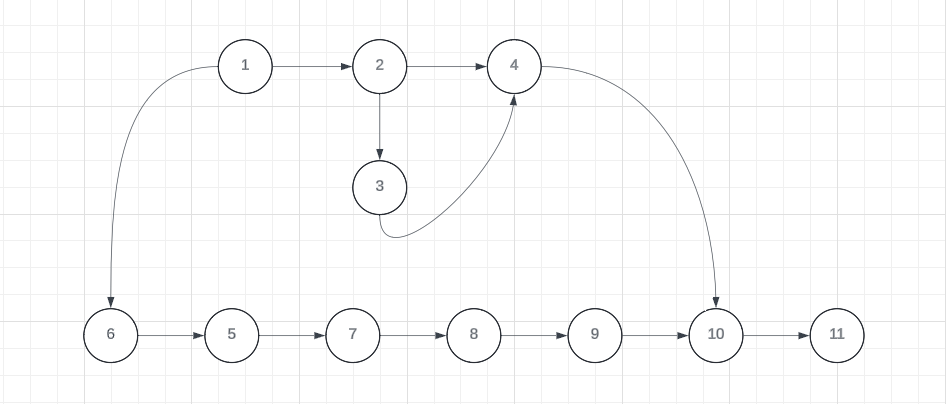

# Projeto Tela de Login com Banco de Dados

Este projeto consiste em uma tela de login desenvolvida em Java que se conecta a um banco de dados MySQL. Os usuários podem fazer login com um nome de usuário e senha, além de adicionar novos usuários ao banco de dados. O objetivo é criar uma interface gráfica que permita a autenticação e a gestão de usuários de forma eficiente e segura.

## Pré-requisitos

- **Linguagem:** Java
- **Bibliotecas:** JUnit para testes unitários, JDBC para conexão com o banco de dados MySQL
- **IDE:** Eclipse

## Estrutura do Projeto

### Classes

- **User:** Esta classe representa o usuário e contém métodos para conectar ao banco de dados e verificar as credenciais dos usuários.
  - **Métodos:**
    - `public Connection conectarBD()`: Estabelece a conexão com o banco de dados.
    - `public boolean verificarUsuario(String login, String senha)`: Verifica as credenciais do usuário no banco de dados.

## Erros Encontrados no Código

### Erro de Digitação na Classe Driver
A classe `com.mysql.Driver.Manager` está incorretamente especificada. A classe correta é `com.mysql.jdbc.Driver`.

### Falta de Tratamento de Exceções
As exceções estão sendo tratadas de forma inadequada. Em vez de apenas capturar e não fazer nada (`catch (Exception e) {}`), é importante pelo menos registrar ou lançar a exceção para que ela não seja ignorada silenciosamente.

### Injeção de SQL
A construção da consulta SQL não está usando prepared statements, tornando o código vulnerável a ataques de injeção de SQL.

### Não Fechamento da Conexão e dos Recursos do Banco de Dados
As conexões com o banco de dados e outros recursos não estão sendo fechados adequadamente após o uso, o que pode levar a vazamentos de recursos e problemas de desempenho.

### Ausência de Documentação
O código não contém documentação adequada, como comentários explicativos para as funções e métodos.

## Grafo de Fluxo

### Grafo

### Análise do Grafo de Fluxo

1. **Declaração da classe:** `public class User {`
2. **Declaração do método:** `public Connection conectarBD() {`
3. **Declaração da variável:** `Connection conn = null;`
4. **Início do bloco try:** `try {`
5. **Declaração Class.forName:** `Class.forName("com.mysql.Driver.Manager").newInstance();`
6. **Declaração da string de URL:** `String url = "jdbc:mysql://127.0.0.1/test?user=lopes&password=123";`
7. **Inicialização da conexão:** `conn = DriverManager.getConnection(url);`
8. **Início do bloco catch:** `} catch (Exception e) {`
9. **Atribuição de variável dentro da condição if:** `nome = rs.getString("nome");`
10. **Declaração de retorno:** `return conn;`
11. **Declaração do método:** `public boolean verificarUsuario(String login, String senha) {`

### Complexidade Ciclomática

O grafo do código possui 12 arestas e 11 nós.

\[ V(G) = 12 - 11 + 2 \]
\[ V(G) = 3 \]

A complexidade ciclomática do código é 3.

### Base de Caminhos

A base de caminhos identificada é:

1. **Caminho 1:** 1 → 2 → 3 → 4 → 5 → 6 → 7 → 8 → 10
2. **Caminho 2:** 1 → 2 → 3 → 4 → 5 → 6 → 8 → 9 → 10
3. **Caminho 3:** 11 → 3 → 4 → 5 → 6 → 7 → 8 → 10

## Implantações

As funcionalidades de login e verificação de usuários foram aplicadas dentro da atividade principal da tela de login, utilizando JDBC para a conexão com o banco de dados MySQL. A classe `User` centraliza a lógica do aplicativo, garantindo a segurança e eficiência no acesso ao banco de dados.

## Versionamento

- **Versão 1.0:**
  - Implementação inicial da tela de login com conexão ao banco de dados.
  - Adição da funcionalidade de login.
  - Correção de erros encontrados durante a análise estática do código.
  - Inclusão de prepared statements para evitar injeção de SQL.
  - Tratamento adequado de exceções e fechamento de recursos.

## Autor

- **Nome completo:** Henrique Ribeiro Borges
- **E-mail:** henriqueribeiroborges@gmail.com
- **RA:** 223997

---

Para mais detalhes sobre a análise estática do código e o preenchimento do formulário de teste estático, consulte o arquivo `PLANO_DE_TESTE.xls` no repositório.
